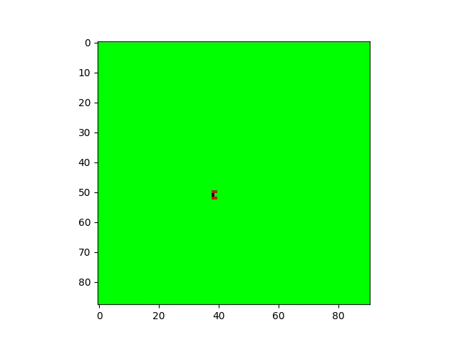
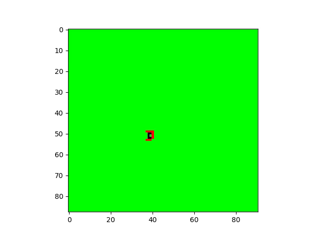
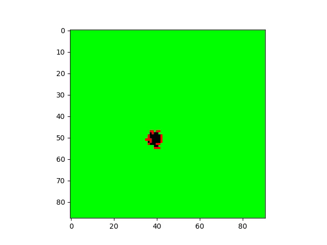
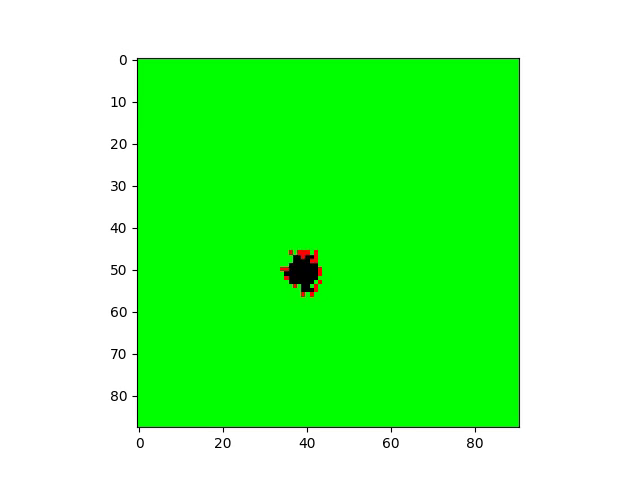
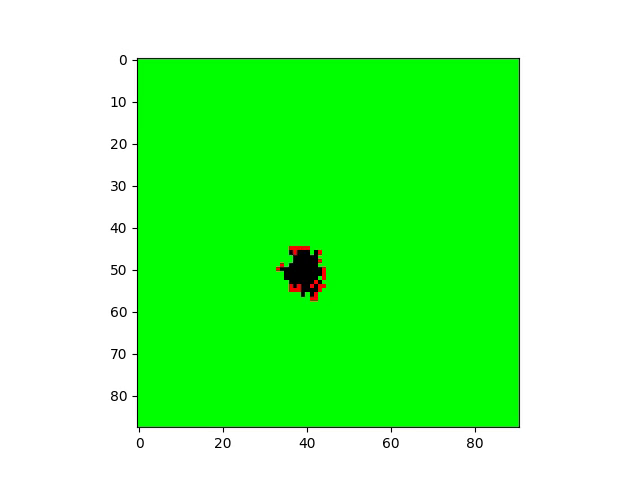
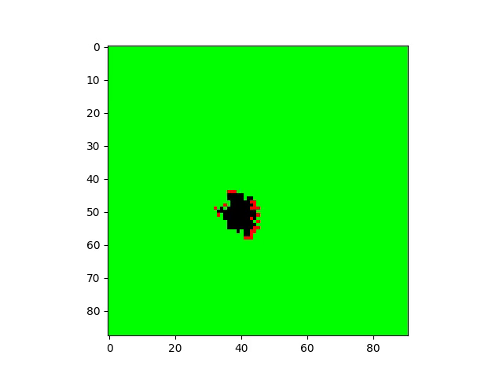
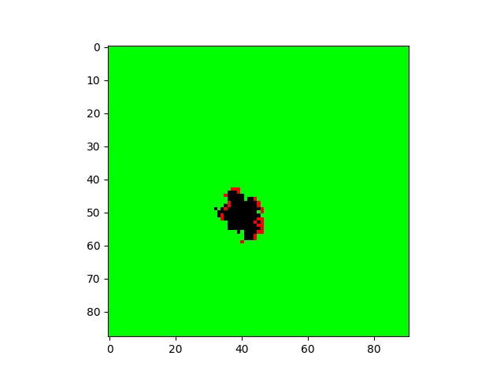

# Simulaciones de incendios

Utilizado para materia Computación Paralela (2025) de FAMAF, UNC

## Modelo de la simulación

   En este proyecto se hacen simulaciones de incendios parametrizadas. La parametrización ocurre de la siguiente manera:

   El terreno esta dividido por celdas (que podrían también llamarse píxeles) y para cada celda se tienen los siguientes datos:

```
burnable ∈ {True, False}
vegetation ∈ {scrub, subalpine, wet, dry}
fwi ∈ ℝ
aspect ∈ [-1, 1]
wind ∈ [0, 2π]
elevation ∈ ℝ
```

   Y para ejecutar la simulación se pasan los siguientes parámetros:

```
β_subalpine ∈ ℝ
β_wet ∈ ℝ
β_dry ∈ ℝ
β_fwi ∈ (0, ∞)
β_aspect ∈ (0, ∞)
β_wind ∈ (0, ∞)
β_elevation(-∞, 0)
β_slope ∈ (0, ∞)
```

   Con eso, la simulación se va ejecutando por pasos, en cada paso hay un conjunto de celdas que son las que se están quemando en ese paso y para cada una de ellas, se calcula la probabilidad de que cada uno de sus vecinos que aun no se quemaron se contagie, usando los datos de la celda, las de la celda vecina y los parámetros.

   La fórmulas exactas de la probabilidad se pueden ver en la función `spread_probability` de `spread_functions.cpp`.

   Luego de calcular cada probabilidad se decide si se quema o no con una variable aleatoria bernoulli.

### Ejemplo

   A continuación se pueden ver imágenes de los primeros 9 pasos en una simulación:

|  |  |  |
| -------------------------------- | -------------------------------- | -------------------------------- |
|  |  |  |
|  |  |  |

## Objetivos

   Hay varios motivos para los cuales se usan las simulaciones:

1) Dados los parámetros, obtener animaciones bonitas de como se desparrama un incendio.

2) Dados los parámetros, calcular la probabilidad de que cada celda se queme haciendo muchas simulaciones.

3) Estimar una función que diga que tan realistas son los incendios producidos por cada combinación de parámetros, usando datos de incendios reales. Esto también haciendo muchas simulaciones.
   
   Este de hecho es el objetivo de el código original que estaba hecho parcialmente en R.

## Uso

Los datos se pueden descargar de [este link](https://cs.famaf.unc.edu.ar/~nicolasw/data.zip) y con `unzip data.zip` se puede descomprimir. También se puede descargar y descomprimir automáticamente con `make data`.

Con `make` se compila.

Para generar una imagen de las probabilidades de quema de cada píxel:

```shell
./graphics/burned_probabilities_data ./data/1999_27j_S | python3 ./graphics/draw_burned_probabilities.py 1999_27j_S_burned_probabilities.png
```

Para generar una animación de un incendio:

```shell
./graphics/fire_animation_data ./data/2000_8 | python3 ./graphics/fire_animation.py 2000_8_fire_animation.mp4
```

## Links

- [Repositorio del código original en el cual fue basado el lab](https://github.com/barberaivan/fire_spread).
- [Paper en el que se uso un método similar pero mas simple](https://ri.conicet.gov.ar/bitstream/handle/11336/38304/CONICET_Digital_Nro.d2f95f9f-ea7f-49ea-8ac4-593883434965_A.pdf?sequence=2).
- [Paper sobre el método estadístico que se usaría para estimar parámetros](http://proceedings.mlr.press/v33/wilkinson14.pdf).

## Sobre los datos

Los datos que están en `data.zip` fueron originalmente extraídos de imágenes satelitales.

## Sobre el código

En la carpeta `src` está el código principal con todas las funciones pero sin ningún main.

En la carpeta `graphics` hay dos mains, uno para la animación de un incendio y otro para las probabilidades de quema de cada píxel.

Los gráficos en si se generan en python, por lo que lo que los mains hacen es imprimir todo por la salida estándar, y los códigos de python leen eso.

En particular, `draw_burned_probabilities.py` lee la salida de `burned_probabilities_data.cpp` y `fire_animation.py` lee la salida de `fire_animation_data.cpp`.
