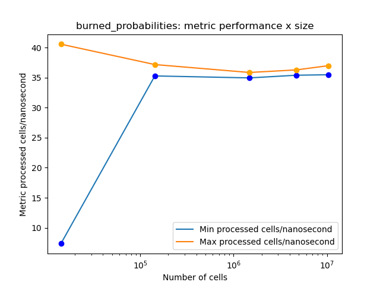
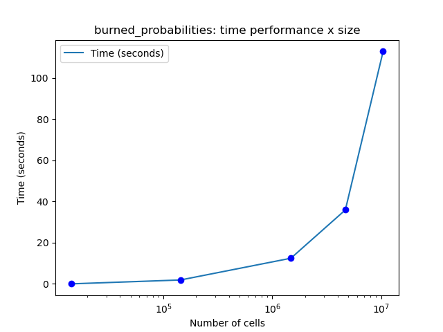

# Informe I

__Integrantes__: Arroyo Joaquin y Bolzan Francisco

__Laboratorio__: fire_spread

## Notas

Realizamos la optimización sobre la simuluación __burned_probabilities__.

## Métricas

__Celdas procesadas x nanosegundo__: Es escalable para diferentes tamaños de simulación y mayor valor indica mejor rendimiento.

__FLOPS__: Mide la cantidad de operaciones de punto flotante por segundo.

__Porcentaje de _cache-hits___: Mide la frecuencia con la que los accesos a memoria cache son exitosos.

Para el cálculo de la primer métrica, contamos cada celda procesada y el tiempo que tardó la simulación, y luego calculamos ```processed_cells / (seconds * 1e7)```.

Para las demás métricas, utilizamos datos obtenidos con ```perf stat```.

## Optimización en g++

Tomamos un caso en particular de tamaño intermedio sobre el cuál experimentamos hasta conseguir las siguiente combinación de optimizaciones:

```
-O1 -ffast-math -funroll-loops -fprefetch-loop-arrays -freorder-functions
```

- __O1__: Bandera que utiliza múltiples optimizaciones tales como ```-freorder-blocks, -fforward-propagate, etc.```.
- __fast-math__: Optimiza operaciones de punto flotante. Alto impacto ya que nuestro código realiza muchas operaciones de este tipo.
- __unroll-loops__: Aplana loops en lo posible, impacto alto porque nuestros loops tienen condiciones predecibles.
- __prefetch-loop-arrays__: Precarga datos a ser usados en bucles. Su impacto es medio, ya que nuestra estructura principal es una matriz que, a partir de ciertos tamaños, no entra en las cachés L1 ni L2.
- __reorder-functions__: Reordena el código en el archivo de salida según su orden de uso o probabilidad de ser llamadas juntas. Notamos una mejora mínima en el rendimiento.
- Probamos las siguientes banderas sin notar mejora significativa: __-O2 -O3 -finline-functions -fhoist-adjacent-loads -mavx2 -mfma -funsafe-math-optimizations__.

## Otros compiladores

### icpx

Notamos que sin optimizaciones explícitas, icpx tuvo mejor rendimiento que g++, esto se da debido a que el primer compilador ya realiza optimizaciones de base.  A medida que agregamos banderas esta diferencia pasó a estar a favor de g++.

### clang

No logramos hacer funcionar las librerías para compilar el programa.

## Optimización en código

Utilizando ```perf report``` vimos que en la comparación para ver si una celda se incendiaba o no, se realizaba una división de doubles lo cuál no es óptimo, por lo que modificamos el código de la siguiente manera:

```
Código previo:
bool burn = (double)rand() / (double)RAND_MAX < prob;

Código actual:
bool burn = rand() < prob * (RAND_MAX + 1.0);
```

Luego de esto, notamos una pequeña mejora en el tiempo de ejecución y en las métricas analizadas.


## Resultados

Estos resultados fueron obtenidos sobre __Atom__.

### Gráficos






### Comparación

Utilizando data __1999_27j_S__:

__Caso sin optimizar__

- __Tiempo total__: 52.06
- __Celdas x Nanosegundo__: 7.97 mínimo y 8.47 máximo
- __FLOPS__: 32.3e7
- __cache-hits__: 68.56%

__Caso optimizado__

- __Tiempo total__: 11.74
- __Celdas x Nanosegundo__: 31.36 mínimo y 37.62 máximo
- __FLOPS__: 102e7
- __cache-hits__: 75.20%

__Conclusiones__

- 77.45% reducción de tiempo de ejecucución.
- Entre 293.48% y 344.16% de mejora entre métrica de celda procesada por nanosegundo.
- 215.79% de mejora en FLOPS .
- 7 puntos porcentuales de mejora en __cache-hits__.

__Descripción del Video con Benchmarks__

[Video](https://youtu.be/nQsPRysa6mE)

```
Integrantes: Arroyo Joaquín y Bolzan Francisco
Laboratorio: fire_spread

Todos los resultados fueron obtenidos en Atom, tal como se menciona en el video.

CPU:
- Modelo: AMD EPYC 7643 48-Core Processor @ 3.64 GHz
- Cantidad de cores físicos: 48
- Hilos por core: 1
- Total de hilos disponibles: 48
- Arquitectura: x86_64
- Virtualización: AMD-V
- Cachés:
  - L1d: 1.5 MiB (48×)
  - L1i: 1.5 MiB (48×)
  - L2: 24 MiB (48×)
  - L3: 256 MiB (8×)

Benchmark DGEMM (double):
- Tamaño de matrices: 19500×19500
- Tiempo de ejecución: 12.948246 s
- Rendimiento: 1,145,309.57 MFLOPS → ~1.15 TFLOPS

Benchmark SGEMM (float):
- Tamaño de matrices: 19500×19500
- Tiempo de ejecución: 6.508257 s
- Rendimiento: 2,278,605.47 MFLOPS → ~2.28 TFLOPS

Benchmark de Memoria (STREAM):
- Ancho de banda (Triad): 30,033.5 MB/s → ~30.0 GB/s (48 hilos)

Sistema Operativo:
- Distribución: Debian
- Codename: trixie
- Versión: sid (inestable, rolling release)
- Arquitectura: x86_64

Compiladores:
- g++ (Debian 14.2.0-16) 14.2.0
- icpx
```