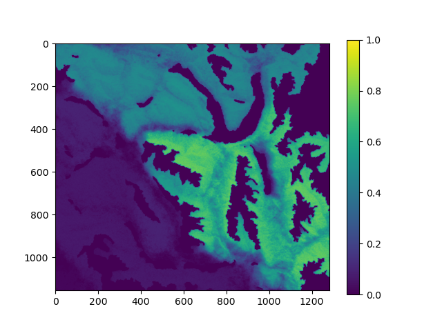
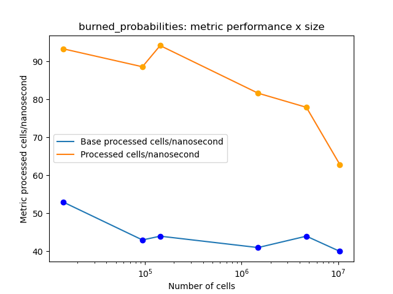
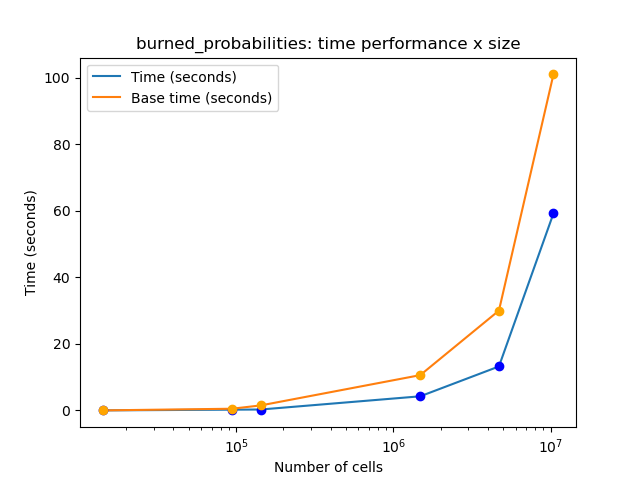

# Informe II

__Integrantes__: Arroyo Joaquin y Bolzan Francisco

__Laboratorio__: fire_spread

## Notas

Realizamos la optimización sobre la simuluación __burned_probabilities__.

## Punto de partida

Estos resultados fueron obtenidos sobre __Atom__ utilizando data __1999_27j_S__:

__Caso base__

- __Tiempo total__: 11.74
- __Celdas x Nanosegundo__: 41.2 máximo
- __FLOPS__: 102e7
- __cache-hits__: 75.20%

## Cambios estructurales y algorítmicos

### Cambios estructurales

Cambios en todas las estructuras `2D` a `1D`, con función ```INDEX``` para acceder a los elementos.

Cambios en el cálculo de número aleatorio que mejoraron la performance utilizando:

```cpp
std::mt19937 rng(123);
std::uniform_real_distribution<float> dist(0.0f, 1.0f);
```

### Cambios algorítmicos

```cpp
for (size_t n = 0; n < 8; ++n) {
    int nc0 = neighbors_coords_0[n];
    int nc1 = neighbors_coords_1[n];
    size_t idx = utils::INDEX(nc0, nc1, n_col);
    bool out_of_range = (nc0 < 0 || nc0 >= int(n_col) || nc1 < 0 || nc1 >= int(n_row));
    if (out_of_range) {
        neighbors[n] = &get_default_cell();
        indices[n] = 0;
        out_of_range_flags[n] = 1;
    } else {
        neighbors[n] = &landscape_data[idx];
        indices[n] = idx;
        out_of_range_flags[n] = 0;
    }
}
```

```cpp
// Se vectorizan las cargas de datos individuales
for (size_t n = 0; n < 8; ++n) {
    elevations[n] = neighbors[n]->elevation;
    fwis[n] = neighbors[n]->fwi;
    aspects[n] = neighbors[n]->aspect;
    vegetation_types[n] = neighbors[n]->vegetation_type;
    burnables[n] = neighbors[n]->burnable;
}
```

```cpp
// Se vectoriza el bucle
for (size_t n = 0; n < 8; ++n) {
    size_t idx = indices[n];
    int burnable = !burned_data[idx] && burnables[n];
    int mask = (!out_of_range_flags[n] && burnable);
    upper_limits[n] = mask * upper_limit;
    processed_cells += !out_of_range_flags[n];
}
```

```cpp
std::array<float, 8> spread_probability (
    ...
    const std::array<float, 8> elevations,
    const std::array<float, 8> vegetation_types,
    const std::array<float, 8> fwis,
    const std::array<float, 8> aspects,
    ...
    const std::array<float, 8> upper_limits
) {
  std::array<float, 8> probs;
  // Se vectoriza el bucle
  for (size_t n = 0; n < 8; n++) {
    // Accedemos a los arrays de forma vectorizada
    float upper_limit = upper_limits[n];
    ...
    // Escribimos de forma vectorizada
    probs[n] = prob;
  }
  return probs;
}
```

## Cosas que NO funcionaron

- Separar calculo de RNG de comparación con las probabilidades obtenidas.
- Pensamos que el cambio en el cálculo de RNG iba a vectorizar, pero no fue así.
- Intentamos agregar _padding_ a la estructura de `Landscape` para evitar el chequeo de límites, pero daba resultados incorrectos.
- No logramos vectorizar este bucle:
```cpp
for (size_t n = 0; n < 8; ++n) {
    if (burn_flags[n]) {
        burned_data[indices[n]] = 1;
        burned_ids_0.push_back(neighbors_coords_0[n]);
        burned_ids_1.push_back(neighbors_coords_1[n]);
        end_forward++;
    }
}
```

## Comprobación de resultados

Utilizando data __1999_27j_S__:



## Performance/Tiempo vs. tamaño del problema






## Conclusiones

Utilizando data __1999_27j_S__:

__Caso a comparar__

- __Tiempo total__: 11.74
- __Celdas x Nanosegundo__: 41.2 máximo
- __FLOPS__: 1.02e9
- __cache-hits__: 75.20%

__Caso actual__

- __Tiempo total__: 4.25
- __Celdas x Nanosegundo__: 81.15 máximo
- __FLOPS__: 5.56e9
- __cache-hits__: 85.41%

__Conclusiones__

- 63.8% reducción de tiempo de ejecucución.
- Aproximadamente un 100% de mejora en nuestra métrica.
- 5x aproximadamente de mejora en FLOPS.
- 10 puntos porcentuales de mejora en __cache-hits__.