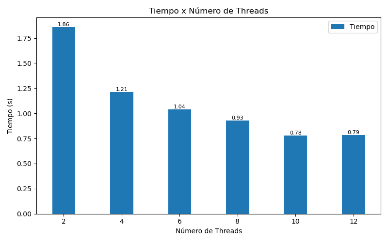
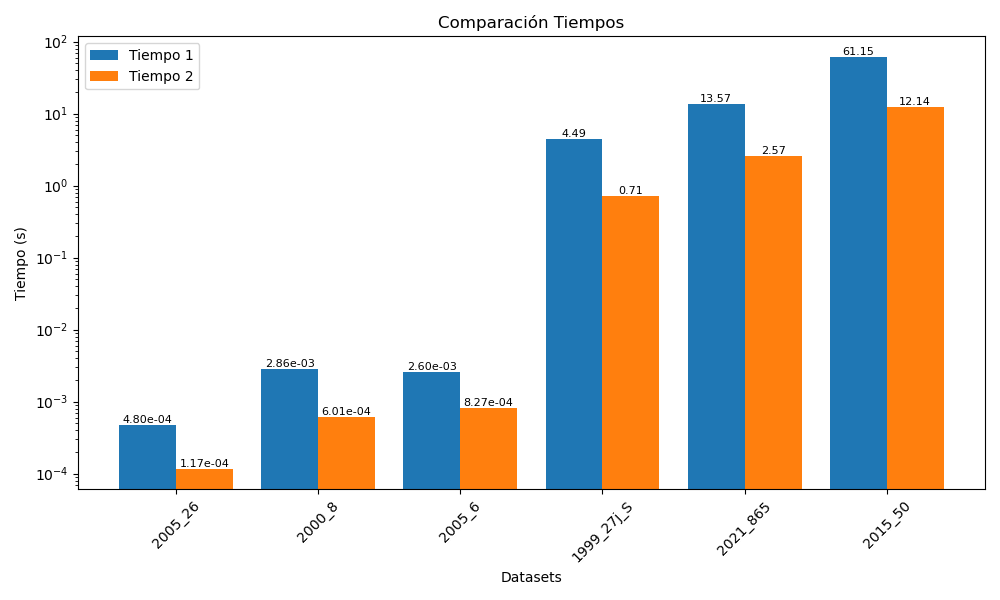
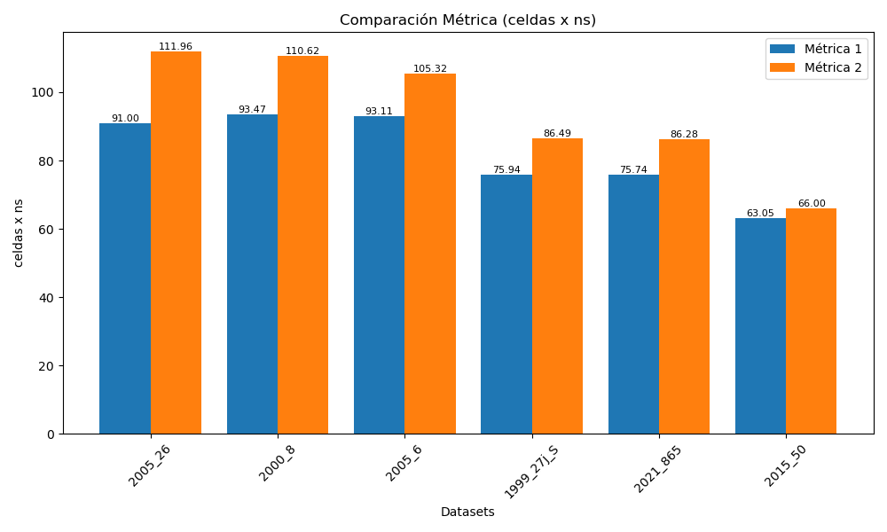
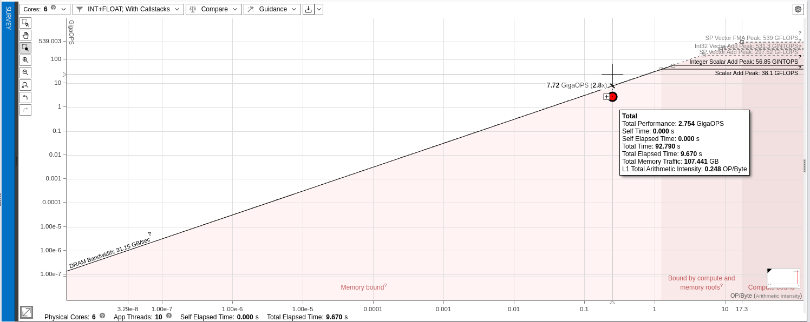

# Informe III

__Integrantes__: Arroyo Joaquin y Bolzan Francisco (FCEIA)

__Laboratorio__: fire_spread

## Notas

Realizamos la optimización sobre la simulación __burned_probabilities__.

Estos resultados fueron obtenidos sobre PC personal:

- CPU: AMD Ryzen 5 PRO 5650U
- 6 cores físicos, 12 lógicos
- 16 GB de RAM

## Estrategias

__[1]__ Paralelizar los bucles internos que realizan los calculos sobre los vecinos de una celda quemada. ❌

```cpp
#pragma omp for ...
for (size_t n = 0; n < 8; ++n) {
    ...
}
```

__[2]__ Paralelizar el bucle que recorre las celdas quemadas. ❌

```cpp
#pragma omp for ...
for (size_t b = start; b < end; b++) {
    // b es el índice de la celda quemada
    size_t burning_cell_0 = burned_ids_0[b];
    size_t burning_cell_1 = burned_ids_1[b];
    ...
}
```

__[3]__ Paralelizar la ejecución secuencial de múltiples simulaciones. ✔️

```cpp
#pragma omp parallel
{ 
    // Variables locales
    #pragma omp for schedule(dynamic, 10)
    for (size_t i = 0; i < n_replicates; i++) {
        Fire fire = simulate_fire(...);
        // Cáculo de métrica y tiempo
        ...
    }
    // Acumulación de métricas y probabilidades
    #pragma omp critical
    {
        ...
    }
    ...
}
```

## Resultados

### Tiempo x Threads

Sobre dataset __1999_27j_S__



A partir de esto realizamos las simulaciones con 10 threads.

### Tiempo

Aproximadamente 3x de mejora.




### Métrica



## Roofline



## Conclusiones

- El tiempo de la simulación mejoró aproximadamente entre 5 y 6x.
- No esperabamos ver un aumento en la métrica.
- Se podría mejorar el procesamiento de las celdas quemadas, paralelizandolo.