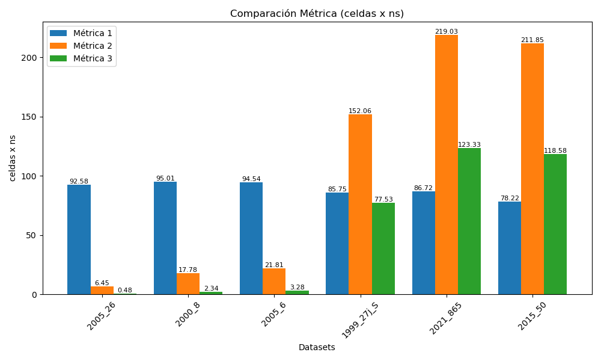

# Informe IV

__Integrantes__: Arroyo Joaquin y Bolzan Francisco (FCEIA)

__Laboratorio__: fire_spread

## Notas

Realizamos la optimización sobre la simulación __burned_probabilities__.

Estos resultados fueron obtenidos sobre Atom y Jupiterace.

No se realizaron mejoras sobre la entrega III.

## Estrategias

### Múltiples kernels

Lanzar un kernel por cada celda quemada del frente de fuego.

```cpp
while (<condition>) {
    // Carga de datos a la GPU
    kernel<<<blocks, threads>>>(...);
    cudaDeviceSynchronize();
    // Actualización de datos
}
```

Logramos replicar los resultados originales, con empeoramiento en el rendimiento.

### Kernel persistente

Lanzar un _kernel_ persistente que procese las celdas quemadas.

- Usa un bucle ```(while (!*flag))```.
- Reduce overhead de CPU–GPU.

```cpp
persistent_kernel<<<blocks, threads>>>(...);
cudaDeviceSynchronize();
```

Cada hilo recibe un _tid_ único. Luego, cada uno procesa múltiples celdas del frente de fuego

```cpp
__global__ void fire_persistent_kernel(...) {
    int tid = blockIdx.x * blockDim.x + threadIdx.x;
    while (!*flag) {
        for (int idx = tid; idx < frontier_len; idx += gridDim.x * blockDim.x) {
            // Procesamiento de celdas
        }
    }
}
```

Esta estrategia permite dividir la carga entre hilos activos.

<!-- Cada hilo:

- Lee una celda del frente de fuego actual.
- Calcula la probabilidad de propagar el fuego a las 8 direcciones.
- Si algún vecino se quema, se agrega al siguiente frente. -->

## Resultados

__Métrica 1__: Entrega III

__Métrica 2__: Simulación CUDA en Atom

__Métrica 3__: Simulación CUDA en Jupiterace



## Potenciales mejoras

1. Lograr realizar múltiples simulaciones en paralelo con _omp_ + la versión de simulación singular en CUDA. En la entrega III logramos lo siguiente:

```cpp
#pragma omp parallel
{ 
    // Variables locales
    #pragma omp for schedule(dynamic, 10)
    for (size_t i = 0; i < n_replicates; i++) {
        Fire fire = simulate_fire(...);
        // Cáculo de métrica y tiempo
        ...
    }
    // Acumulación de métricas y probabilidades
    #pragma omp critical
    {
        ...
    }
    ...
}
```

y al querer integrarlo con CUDA tuvimos inconsistencias, por lo que se descartó la paralelización con _omp_ y se continuó solo con CUDA.

2. Seguir buscando optimizaciones en la simulación actual.
3. Volver a la primer estrategia y buscar una forma de mejorar el rendimiento con múltiples kernels.

## Conclusiones

- Logramos mejorar el rendimiento de la simulación en datasets medianos y grandes.
- Por el contrario, se nota un empeoramiento en datasets pequeños:
    - Overhead de lanzamiento del kernel.
    - Subutilización de la GPU.